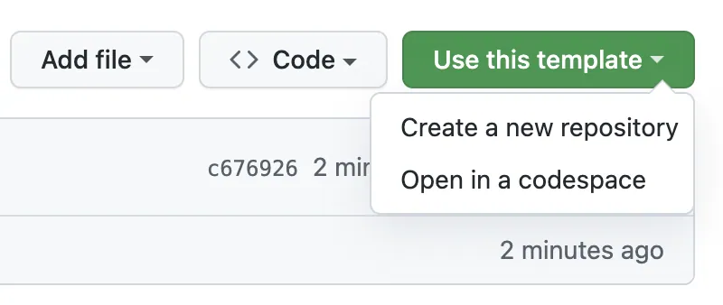
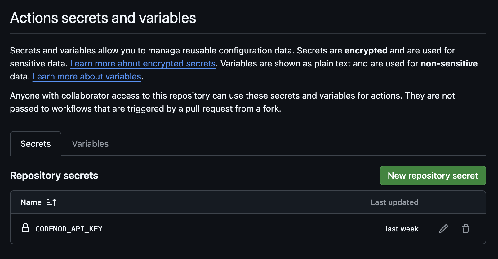

# Codemod Template

Codemods, public or private, are preferred to reside in repositories owned by the main organization of their respective projects.

This repository serves as a template for codemod packages, allowing contributors to quickly whip up a repository for their published codemods.

This template repository comes pre-configured with a GitHub workflow that automatically publishes the latest version of your codemod, eliminating the need to [manually publish codemods](https://go.codemod.com/codemod-publish-doc) after making updates.

## Preparing repository

1. Click **Use this template**.

   
2. Select **Create a new repository** and enter your new repository details.
3. **Login** with [Codemod CLI](https://go.codemod.com/cli-docs): `codemod login`.
4. Generate a **Codemod API key**: `codemod api-keys:create`.
5. Place your API key in a **new repository secret** under `Settings > Secrets and Variables > Actions`.

   
6. [Create](https://go.codemod.com/build-codemod-docs) or move your codemod package(s) under the `codemods` directory. Note that your codemods should conform to the [required package structure](https://go.codemod.com/codemod-package-structure). Additionally, make sure that your `codemodrc.json` files are accurate.

By doing so, any change made to the `main` branch of your repository will automatically be published to [Codemod Registry](https://codemod.com/registry).

## Running codemods

To run your codemods use [`codemod`](https://go.codemod.com/github) command below:

```console
$ npx codemod [codemod-name]
```

- `codemod-name` - name of transform. use the name of your codemod in [Codemod Registry](https://codemod.com/registry).

See the [codemod CLI doc](https://go.codemod.com/cli-docs) for a full list of available commands and options.

> [!IMPORTANT]
> After using this template, it's recommended that you update this README with:
>
> 1. details about what your codemod does (e.g. before/after code snippets)
> 2. a link to the published codemod in Codemod Registry
> 3. the accurate run command.
